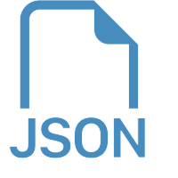

# Godot Improved JSON

Godot Improved JSON is a Godot 4.4 (or later) addon that provides seamless methods of serializing any variant, including Objects and their properties.
   

## Table of Contents
- [FAQ](#FAQ)
- [Why?](#Why)
- [Support Links](#Support-Links)
- [Installation](#Installation)
- [Limitations](#Limitations)
- [Basic Usage](#Basic-Usage)
- [Object Serialization](#Object-Serialization)
- [Examples](./examples/)
	- [Custom Objects](examples/object)
   

## FAQ
- **Will versions earlier than Godot 4.4 be supported?** No, I wanted to be sure typed Dictionaries were included without the hassle of detecting current version.
   

## Why?
Originally this project was created to bring JSON support to all of Godot's native types, including Objects & their properties. But with [Godot 4.4-dev2](https://godotengine.org/article/dev-snapshot-godot-4-4-dev-2/)'s release, [this pull request](https://github.com/godotengine/godot/pull/92656) was merged doing just that. However, after testing the new changes there were still issues that this project solves, predominantly in regards to Objects.

The current issues with Godot's new JSON changes that this project addresses are:
- `JSON.stringify(variant)` and `JSON.parse(variant)` do not detect the variant's type, it is redundantly required to use `JSON.stringify(JSON.from_native(variant))` and `JSON.to_native(JSON.parse(variant))`. Improved JSON automatically detects any variant's type and serializes it accordingly, without the need for boilerplate.
- JSON Object support for custom objects in native Godot is still questionable, and currently appears broken. In the above point, if `variant` were to be an instance of `MyCustomClass`, when you deserialize it you will not receive an instance of `MyCustomClass`, just an instance of its base type (such as Resource). There is no property way to simply convert your objects to JSON & back without your own boilerplate, which this project aims to eliminate.
- A lot of internal properties that you don't need serialized are included Godot's `JSON.to_native` function. With this project, you tell the system what should be serialized. This tremendously cuts down the file sizes and speeds up load times. But most importantly it ensures your saving & loading behave how *you* want it to.
- Godot 4.4's new `JSON.from_native()` method returns a Dictionary that contains fully spelled out keys such as `__gdtype` for the `Variant.Type`, `basis` and `origin` for `Transform3D`'s values, & more. Improved Godot JSON uses short, one character keys. Again, this increases efficiency and reduces file size, which can add up when dealing with larger JSON files.

   

## Support Links
For now, [open up a new issue](https://github.com/neth392/godot-improved-json/issues) or message me on Discord for direct support @ **cneth**

   

## Installation
I'll be submitting this project to the Godot AssetLib for easier installation, & will update this accordingly once done. For now see the steps to install:
1) [Download the latest release](https://github.com/neth392/godot-improved-json/releases)
2) With your project open in Godot, go to the "**AssetLib**" tab, press the "**Import...**" button, then navigate to the downloaded zip file and select & open it.
3) Click "**Install**" in the window that pops up. Click **OK**. 
4) Go to **Project Settings**, **Plugins**, and then enable `Improved Godot JSON`
5) Ignore any errors that appear and **reload the project.**

After installing it there is an additional step if you want `Object` support. In Project Settings there is a new setting the plugin adds under `improved_json/config/json_object_config_registry`. That setting must point to a resource of the type `JSONObjectConfigRegistry` anywhere within your project's directory (more on this later). So to set that up, right click the desired folder in the FileSystem dock and create a new `JSONObjectConfigRegistry` resource. The name or location don't matter, just make sure the extension is `.tres`. Go back to Project Settings and set the above setting to the file path of your new registry resource file.

   
 
## Limitations
- Serialized objects **must** have an explicit `class_name` defined in their script.
- If a custom object has a constructor, it **must have default values for each parameter** unless you use `JSONSerialization.parse_into(object)` (which does not construct a new instance of an object). If a constructor does not have default parameters, an error explaining such will be thrown when you try to deserialize an instance of it.
- Only the first (top most) constructor  in a class's script is used. I am considering adding support for selecting which constructor, but as of now I believe it is best to just use the first constructor.
- Nested/inner classes are **not supported**.
- A `JSONObjectConfigRegistry` file somewhere in the project directory is **required**. Object serialization will not work without it, but the addon *shouldn't* break completely.
- `TYPE_CALLABLE`, `TYPE_SIGNAL`, `TYPE_RID`, & `TYPE_MAX`  are **not supported**.
- There is currently a "bug" that causes the `JSONSerialization` autoload to have it's `_ready()` function called twice in the editor when the project is opened. I have tried everything to fix this and can not figure it out (if anyone could help that would be amazing). This shouldn't be noticeable at all.

   

## Basic Usage

TODO

For an example, see the [Basic Example](examples/basic).
   

### Important Notes on Dictionaries
JSON does not allow for keys to be JSON objects or arrays, therefore *every* key in Godot's `Dictionary` type is stored as a String. 

The keys in a Dictionary's JSON equivalent are prefixed with the # index & a `:`, such as `0:`, `1:`, `2:`, and so on. This is because Objects, Arrays, & Dictionaries may have the same properties, keys, or values but are of different instances and are not truly equal `==`. Those identical variants are serialized to the exact same JSON, and JSON objects can not have the same key twice. So to support those rare cases, a prefix was added.

In order to preserve dictionary ordering ([it does exist in Godot](https://docs.godotengine.org/en/stable/classes/class_dictionary.html#description)), `JSONSerializationImpl.sort_keys` **must** be `false`. Otherwise, Godot's `JSON` class will not preserve your key ordering when serializing.

   

## Object Serialization

TODO

For an example, see the [Object Example](examples/object).
   

[Back to Top ↑](#Godot-Improved-JSON)